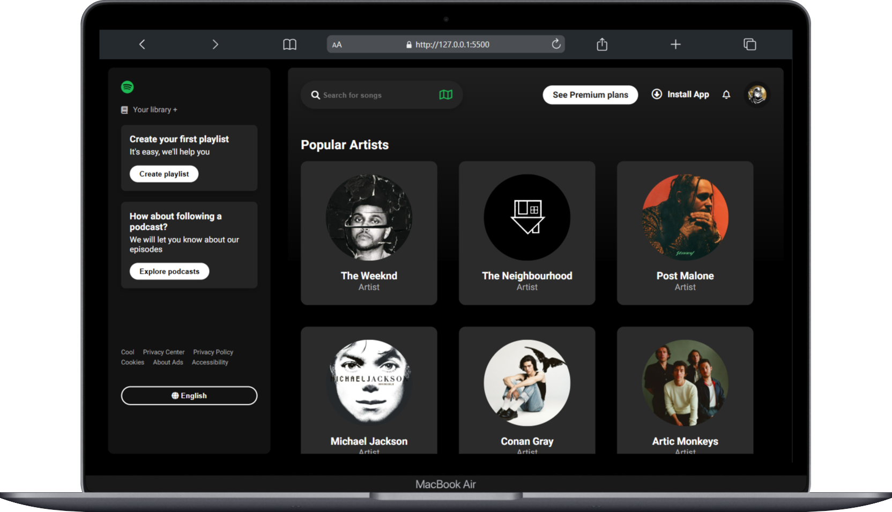

# Spotify Clone 🎵

A visually stunning and functional Spotify-inspired web application, designed to replicate the look and feel of the popular music streaming platform. Built with a focus on responsive design and smooth user interactions.

## Features ✨

- 🎨 **User Interface:** A sleek and modern design inspired by Spotify's iconic layout.
- 📱 **Responsive Design:** Optimized for desktop, tablet, and mobile devices.
- 🔄 **Dynamic Components:** Interactive artist and album cards with hover effects.
- 🎧 **Play Button Animation:** Smooth transitions and animations for a better user experience.

## Tech Stack 🛠️

- **HTML5** for structure.
- **CSS3** with modern features like flexbox, grid, and animations.
- **JavaScript (ES6)** for dynamic interactions.
- **FontAwesome** for icons.

## Installation 🚀

1. Clone the repository:
   ```bash
   git clone https://github.com/pedro-dev-design/spotify-clone.git
   ```

2. Navigate to the project directory:
   ```bash
   cd spotify-clone
   ```

3. Open `index.html` in your browser to view the project locally.

## Preview 🖼️



## Usage 🎶

- Explore artist and album cards.
- Hover over cards to reveal play icons and animations.
- Enjoy a visually engaging web experience.

## Contributing 🤝

Contributions are welcome! If you have ideas to improve the project, feel free to fork the repository and create a pull request.

## Contact 📧

- **Author:** Pedro
- **GitHub:** [pedro-dev-design](https://github.com/pedro-dev-design)

---

⭐ If you like this project, don't forget to star the repository!
